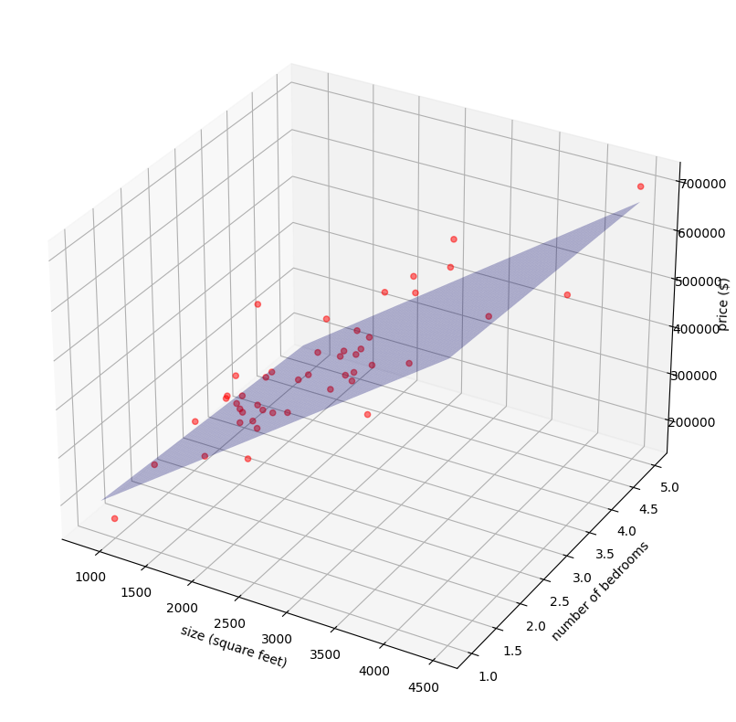
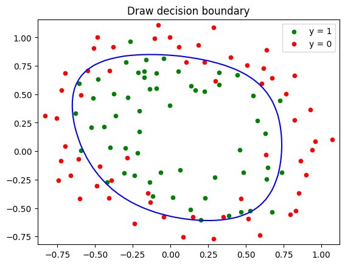

# Linear & Logistic Regression Implementation in Python

This repository contains Python implementations of Linear Regression and Logistic Regression for two common machine learning tasks:
- predicting house prices using [Linear Regression](Linear_Regression/LinearRegression.ipynb).
    
- classifying data using [Logistic Regression](Logistic_Regression/config.json).
    

### Dependencies
- Python >= 3.8
- numpy >= 1.19.2
- pandas >= 1.1.3
- matplotlib >= 3.3.2
- seaborn >= 0.11.0

Or you can install all dependencies using the following command:
```bash
pip install -r requirements.txt
```

### Final Note
If you are HCMUS student and you are taking the course CSC15004 - Statistics Learning, feel free to use this repository as a reference and cite it properly. Thanks!